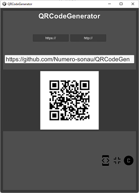

# QRCodeGenerator
  
テキストからQRCodeを生成するツール。
- ローカル処理のため、テキスト情報が外部に漏れることがない。
- 比較的シンプルなUI(広告等が出ない)

## Version
0.1

## Info
- [Unity version] 2021.3.8f1 (apple silicon)  
- [supported platforms] Android / Windows  
- [experimental platforms] iOS / macOS / WebGL  

## Assets
- ZXing.Net 0.16.8 (Apache License 2.0)  
https://github.com/micjahn/ZXing.Net
- Google Fonts Material Icons (Apache License 2.0)  
https://developers.google.com/fonts/docs/material_icons
